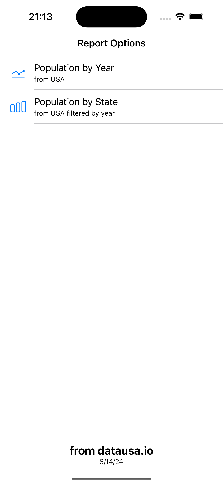
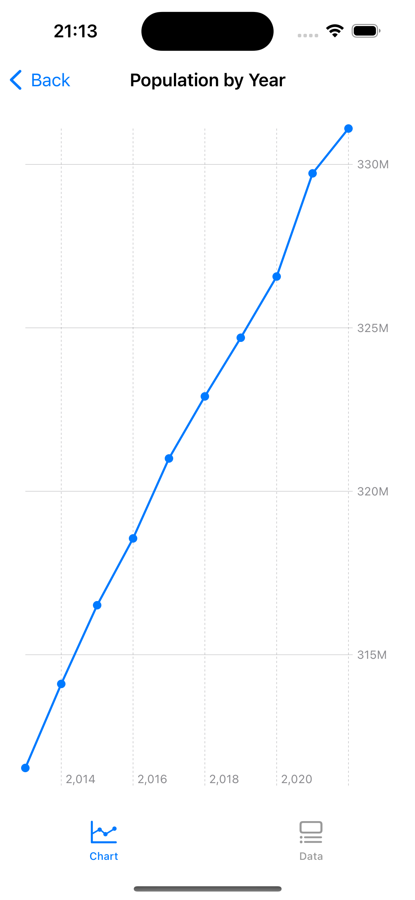
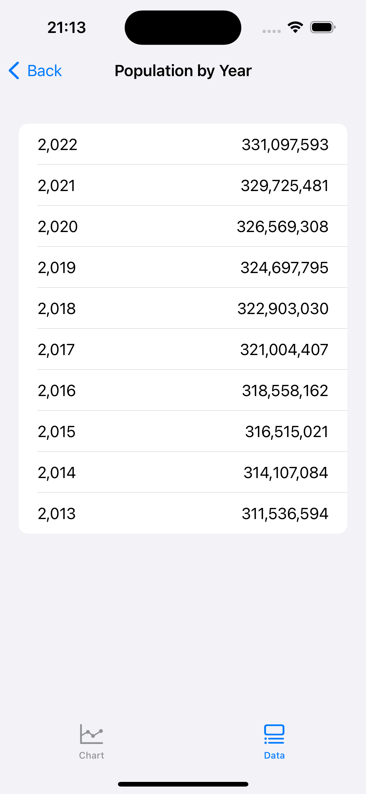
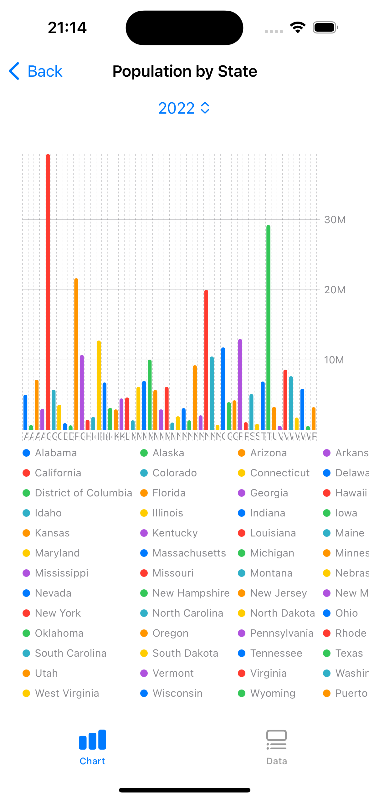
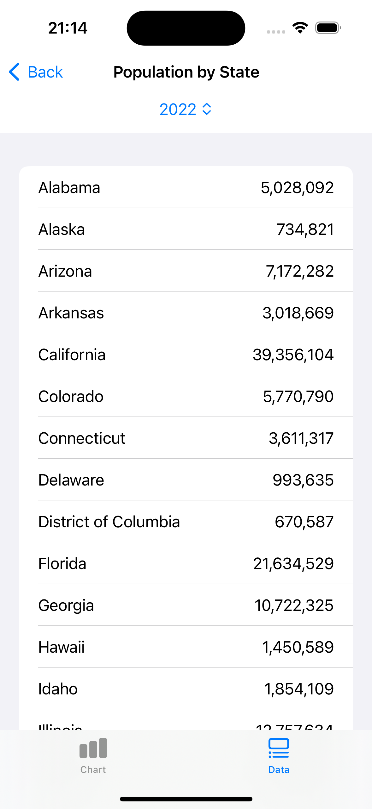
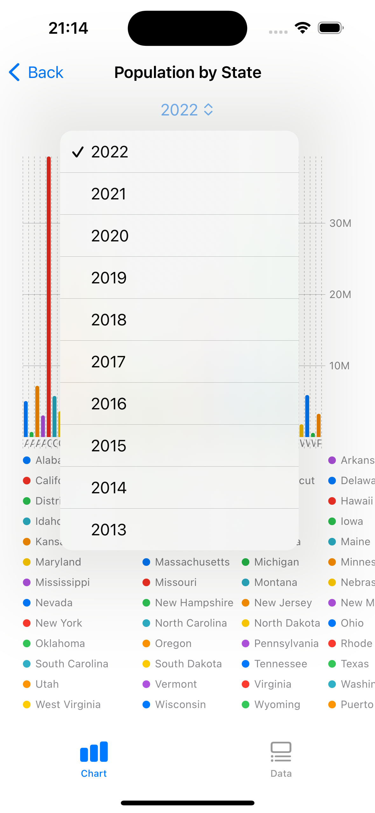

# Project Structure Overview:

 - App/DataUSA: App configuration and entry point.
 - CoreLayer: All Protocols and common code that can be shared between all modules.
 - DependencyInjection: All the dependency injection setup and orchestration. This is how the Horizontal dependency is working. Only this module and App module has access to all modules.
 - DomainLayer: All the business logic here
 - DataLayer: All the data related code. Repositories, DataSources, Services, etc.
 
 - NOTE: Integration Tests and Unit Testes was developed only in DataLayer Module

# SPM - Swift Package Manager Used:

 - AJDependencyInjection: Developed by me, has the responsability to be an independent module responsible for register and resolver dependency injections. 
    - https://github.com/haroldjose30/AJDependencyInjection
 - AJHttpClient:  Developed by me has responsability to be an independent module responsible for all HTTP request handlers. 
    - https://github.com/haroldjose30/AJHttpClient

# App Screenshots

| Name | Image |
| --- | --- |
| Main                     |  | 
| PopulationByYear Chart   |  |
| PopulationByYear Data    |  | 
| PopulationByState Chart  |  |
| PopulationByState Data   |  | 
| PopulationByState Picker ||

